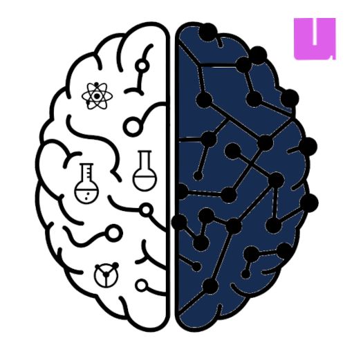

How To Use
---

Citation
---
The logo for this repository (logo.png) was generated using Google Gemini 2.0 Flash (Imagen 3) on Mar. 26, 2025 with the prompt "Create a logo of outline of a brain with one half including symbols reminiscent of science, for example an atom, beaker, pendulum, or satellite, and the other half a small fully connected neural network displaying the connected nodes."
